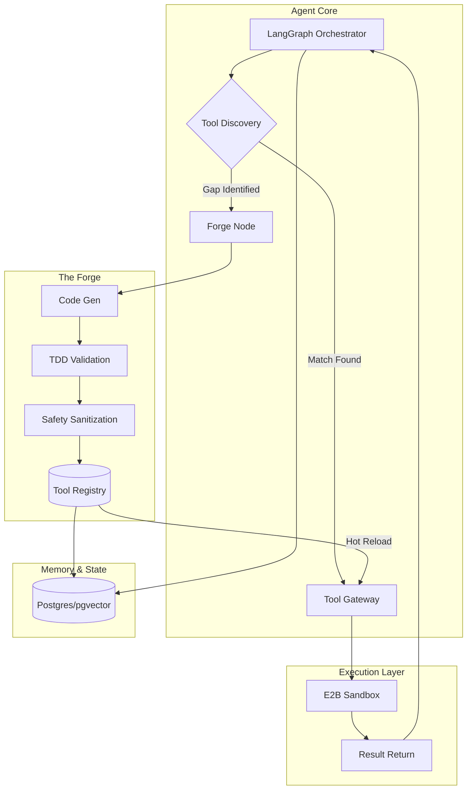

# Architecture: AgentForge Kernel Stack

## Overview

AgentForge is a scaffolded AI agent kernel designed for autonomous capability expansion. It solves the "static toolset" limitation of current agents by implementing a **Toolsmith Mechanism**: a closed-loop system where an agent identifies a capability gap, generates a validated tool artifact via a specialized Forge Node, and hot-reloads that tool into its runtime environment without process restarts. The architecture leverages LangGraph for stateful orchestration and E2B for secure, sandboxed execution.

## System Components

1.  **Orchestration Kernel (LangGraph):** The central nervous system managing the Recursive Sub-Graph Protocol (RSGP). It maintains persistent state, handles multi-retry loops, and routes requests between the agent and the Tool Gateway.
2.  **Forge Node:** A specialized subgraph that receives "convince" dossiers (requirements). It performs LLM-based code generation, generates synthetic Pydantic test suites, and validates tool artifacts against safety rails.
3.  **Tool Gateway:** An out-of-process execution layer. It manages the Tool Registry, performs schema validation on inputs/outputs, and enforces capability-based permissions.
4.  **Semantic Skill Index (SSI) & Registry:** A Postgres/pgvector store that holds tool manifests, content-hashed source code, and vectorized docstrings for RAG-based tool discovery.
5.  **E2B Sandbox:** A secure, isolated environment where generated tools are executed and validated, preventing side effects on the host system.

## Component Diagram

## Technology Stack

-   **Language:** Python 3.11+
-   **Orchestration:** LangGraph (Stateful graphs), LangChain (LLM abstractions)
-   **Execution Sandbox:** E2B (Code Interpreter SDK)
-   **Database:** PostgreSQL with `pgvector` (Persistence & Semantic Search)
-   **Validation:** Pydantic v2 (Schema enforcement & TDD specs)
-   **LLM Provider:** OpenRouter API (model-agnostic; supports OpenAI, Anthropic, Google, DeepSeek, Mistral, and 100+ models with dynamic configuration per model)
-   **LLM Integration:** Any OpenRouter model ID configurable (e.g., `openai/gpt-4-turbo`, `anthropic/claude-3-opus`, `google/gemini-2.0-flash`, `deepseek/deepseek-chat`), with per-model reasoning parameters, temperature, and system prompt variants
-   **Versioning:** Content-addressed Merkle-style hashing for tool artifacts

## Design Principles

1.  **Evidence-Based Validation (EBV):** No tool is registered unless it passes a contract-first TDD suite with 100% success in the E2B sandbox.
2.  **Hot-Reloadable Agency:** Tools are treated as dynamic artifacts; the Gateway must support DB-driven registration to allow instant use without system restarts.
3.  **Hierarchical Circuit Breaking:** All recursive calls inherit a depth-budget and token-spend limit from the parent process to prevent infinite loops and cost cascades.
4.  **Probabilistic Reliability Bounds (PRB):** Tools are tagged with maturity tiers based on historical success rates, allowing the agent to choose stable tools over experimental ones.
5.  **Atomic Shadow-State:** State updates are staged and committed only upon successful tool execution, ensuring the agent's memory remains uncorrupted by failed attempts.

---
*Generated from AI Innovation Council boardroom plan*